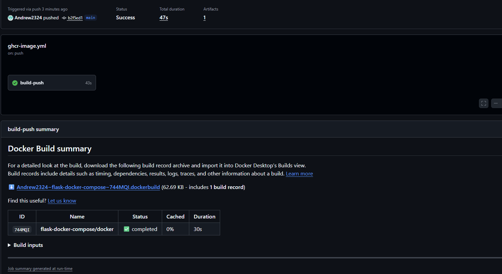

# Flask API in Docker + Docker Compose (with Postgres)

This project demonstrates containerizing a Python Flask API using a production friendly Dockerfile and running a multi-service local environment with Docker Compose (**API + Postgres**). It also documents real-world troubleshooting and failure scenarios.

## CI/CD – Container Build & Publish

This project uses GitHub Actions to automatically build and publish the Docker image to GitHub Container Registry (GHCR) on every push to `main`.

### Image
```bash
ghcr.io/andrew2324/flask-docker-compose:latest


```
## Why this exists
This repo demonstrates core skills:

- Packaging an app into a repeatable container image (**Dockerfile**)
- Running a realistic multi-service environment (**Docker Compose**)
- Dependency readiness (API waits for DB before starting)
- Operational verification (health endpoint + logs + curl validation)
- Troubleshooting common failure scenarios (DB auth, env/config, connectivity)

## Tech used
- Python + Flask
- Gunicorn (WSGI server)
- Postgres 16
- Docker + Docker Compose

## Ports
This project intentionally uses **port 5000 everywhere**:
- The API listens on `:5000` inside the container
- Docker Compose publishes `5000:5000` for local access
---

## Architecture


**High-level flow:**
- Client sends HTTP requests to the Flask API on port 5000
- The API runs in a Docker container using Gunicorn
- The API connects to a Postgres container over the Docker Compose network
- Postgres persists data in a Docker volume


ASCII diagrams always render.

```md

User / curl / browser
        |
        | HTTP :5000
        v
+--------------------+
| Flask API (Docker) |
| Gunicorn           |
+--------------------+
        |
        | SQL
        v
+--------------------+
| Postgres 16        |
+--------------------+
```
---

## Prerequisites

Docker Desktop (Windows/Mac) or Docker Engine (Linux)

Docker Compose plugin

Quick start (local)
cp .env.example .env
docker compose up --build -d

---
# Verify
docker compose ps
curl http://localhost:5000/health
curl http://localhost:5000/

---

# Logs
docker compose logs -f api

---

# Stop
docker compose down

---

## **What the API does**

-GET /health returns:
  -{"status":"ok"}
-GET / writes a row to Postgres (visits table) and returns:
  -last inserted row
  -running total_visits

---

## Troubleshooting / Failure scenarios
1) API container exits on startup (DB auth failure)

Symptom: logs show FATAL: password authentication failed for user ...
Cause: DATABASE_URL does not match POSTGRES_USER/POSTGRES_PASSWORD
Fix:
-Update .env to match DB credentials
-If Postgres was initialized with old creds, reset the dev volume:

docker compose down -v
docker compose up --build -d

2) /health works but / returns 500

Symptom: GET / returns 500
Cause: DB not reachable, wrong host (localhost vs db), or schema not initialized
Fix:
docker compose logs --tail 200 api
docker exec -it flask-docker-compose-api-1 env | grep DATABASE_URL
docker exec -it flask-docker-compose-db-1 psql -U appuser -d appdb -c "\dt"

3) Works locally but not from another device

Cause: firewall/security group doesn’t allow inbound 5000
Fix: open inbound port 5000 or put a reverse proxy in front (recommended for real deployments)

---

## What I learned
This project gave me hands on experience running a containerized application from to to bottom. I built and deployed a Flask API in a production style Docker container using Gunicorn, orchestrated the API and Postgres with Docker Compose, and added health checks and startup logic so the service waits for the database and initializes its schema before serving traffic. I worked through real operational issues like database authentication mismatches, environment variable misconfigurations, and connectivity problems, and documented repeatable troubleshooting steps. The entire stack runs consistently on port 5000.

---

## Live verification (real output)

**Start the stack**

docker compose up --build -d

**Output:**

[+] up 4/4
 ✔ Image flask-docker-compose-api       Built
 ✔ Network flask-docker-compose_default Created
 ✔ Container flask-docker-compose-db-1  Healthy
 ✔ Container flask-docker-compose-api-1 Created

**Confirm containers + ports**

docker compose ps

Output:
NAME                         IMAGE                      COMMAND               SERVICE   STATUS                    PORTS
flask-docker-compose-api-1   flask-docker-compose-api   "/app/entrypoint.sh"  api       Up                         0.0.0.0:5000->5000/tcp
flask-docker-compose-db-1    postgres:16                "docker-entrypoint…"  db        Up (healthy)              0.0.0.0:5432->5432/tcp

**Test endpoints**

curl http://localhost:5000/health
curl http://localhost:5000/

Output:
{"status":"ok"}
{"last_visit":{"id":1,"visited_at":"Tue, 03 Feb 2026 18:52:12 GMT"},"message":"Flask API running in Docker + Compose","total_visits":1}

